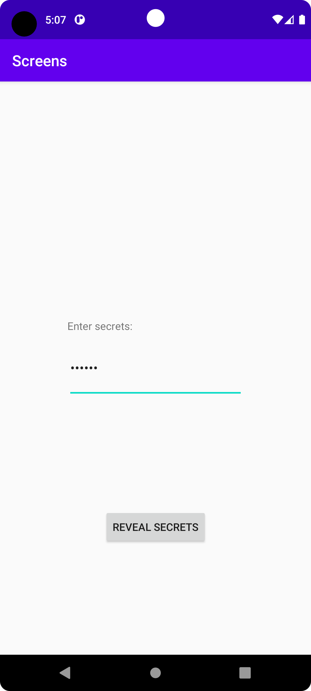
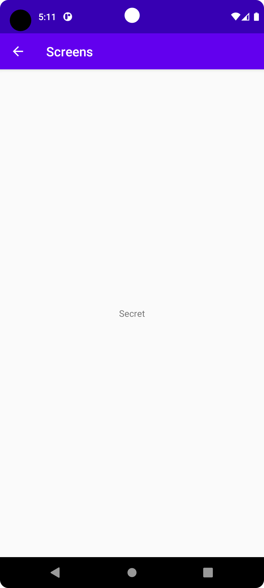

# Rapport

To begin with, I added an editText, button, and textView in the main activity.
These were then styled to sit in the middle of the screen going downwards vertically.

Another activity was created, a textView was added in the middle.

The following code is from the middle of the OnCreate() method in MainActivity:
```
    Button button = findViewById(R.id.revealButton);
    button.setOnClickListener(new View.OnClickListener() {
        @Override
        public void onClick(View view) {
            EditText secrets = findViewById(R.id.secrets);
            String secretText = String.valueOf(secrets.getText());
            Intent intent = new Intent(MainActivity.this, Revealed.class);
            intent.putExtra("secretText", secretText);
            startActivity(intent);
        }
    });
```
This code begins by assigning a new OnClickListener, then opening up to define it.
Upon the button being clicked, the intent is defined as the text currently written in secrets.
Before starting the next activity, called Revealed in this case.

This leads to the first activity looking like (text written in bar is "Secret"):



The following code is taken from OnCreate in Revealed:
```
    Bundle extras = getIntent().getExtras();
    if (extras != null) {
        TextView mainText = findViewById(R.id.mainText);
        String secretText = extras.getString("secretText");
        mainText.setText(secretText);
    }
```
This is the main piece of code used in Revealed.
It very simply checks for any extras sent upon it starting and, should it not be null,
sets its own textView's text to whatever text was sent over.

Revealed then looks as follows, building upon the example set in the last screenshot:



As can be seen, the program works as intended with the text written in the first activity being
displayed in the second.